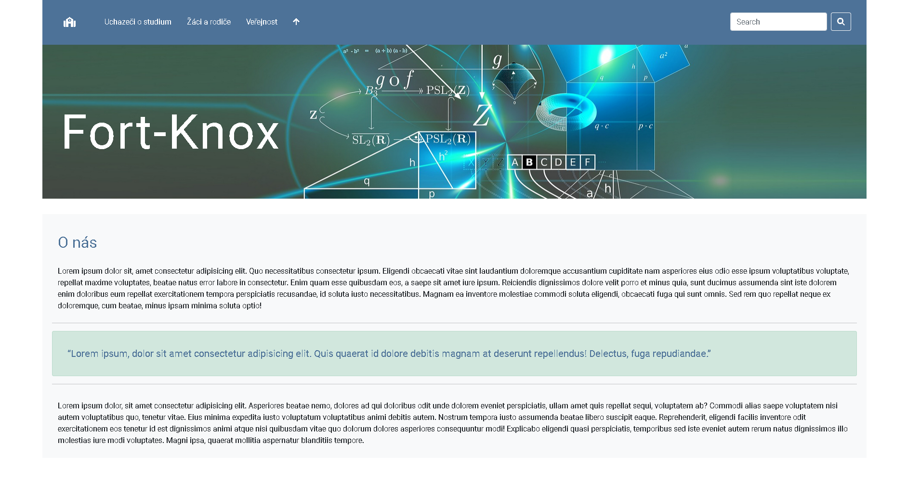

# School-Website-Design
This project I was building to learn the principles of Bootstrap 5 and CSS3. All files are non-attribution required.

## How to make project functional 
Just clone/download repository to your local machine and open index.html file

You shall see something like this:

